# Worksheet 2 - Part 1
## Overview 
In this Worksheet we had to implement basic input/output using the VGA framebuffer, following Chapter 4 of The Little Book of OS Development. This was achieved by loading the kernel using GRUB and transferring control from assembly to C, and producing text output directly from hardware interaction.

# Task 1 - booting a tiny OS
First I created the directory structure described in the worksheet and writing the kernel in assembler.

Following the worksheet I created loader.asm which is the intial kernel which contained:
* A multiboot header 
* A entry label loader used as the kernel entry point
* And mov eax 0xCAFEBABE, which is a test that writes cafebabe to the eax register.

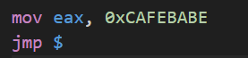

Then the assembler file was complied using the NASM specified in the worksheet: nasm -f elf32 loader.asm
A linker script called link.ld was made as shown in the worksheet with:
* ENTRY(loader)
* And the kernel loaded at the address 0x00100000 1MB
The kernel was linked using ld producing kernel.elf which GRUB loads into memory.

Then I downloaded Stage2_eltorito and placed it in the grub directory and with all the files in placed, I generated the .iso image using the following command: 
genisoimage -R\
-b boot/grub/stage2_eltorito\
-no-emul-boot\
-boot-load-size 4\
-A os\
-input-charset utf8\
-quiet\
-boot-info-table\
-o os.iso\
iso

Finally, to test that the ISO was running correctly I ran it using qemu and checked the logQ.txt. As you can see below CAFEBABE was found in logQ.txt many times 

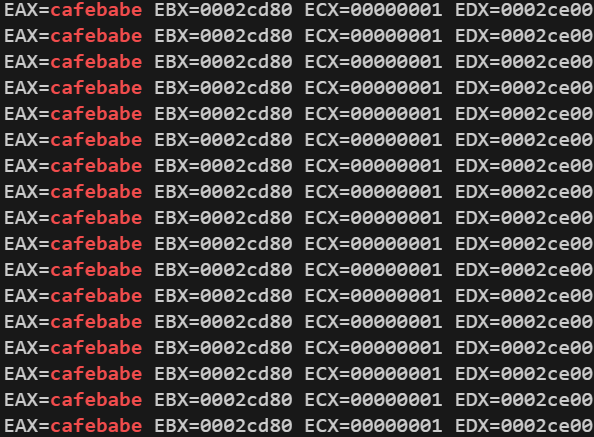

## Task 2 - Calling C from Assembler
In Task 2 I had to extend the kernel so that control can be transferred from assembler to C.

the assembler loader was modified to:
* Set up a stack manually
* And Call the C function Kmain

The Makefile was updated to:
* compile C source files in source/ 
* And link them together with the assembler object files 

Below you can see the OS being launch using these new changes:

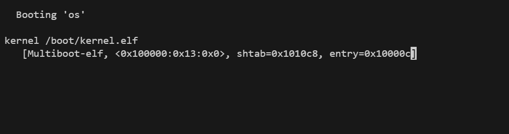

## Task 3 - Simple I/O using the Framebuffer
In Task 3 I had to add a basic I/O, using the information from chapter 4 of the OS book.

The VGA text framebuffer is accessed using memory-mapped I/O at the address 0x000B8000.

Each screen cell consists of:
* One byte for the ASCII character 
* And one byte for the colour attribute.

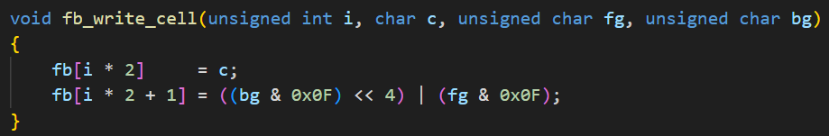
A framebuffer was implemented in the driver/ directory. writing directly to this address allows text to be displayed on the OS screen.

Some hardware devices require I/O ports rather than memory-mapped access. The framebuffer cursor is one example. 
An outb routine was added in assembly to write to the I/O ports 0x3D4 and 0x3D5, allowing the hardware cursor position to be updated. 

Finally, to complete Task 3, the framebuffer was extended to expose a full API meaning:
* The cursor movement uses a 2D interface,
* Writing strings to the screen,
* clearing the framebuffer,
* supporting the text colour via attribute bytes.
The kernel uses this API to test the functionality by clearing the screen and printing text.

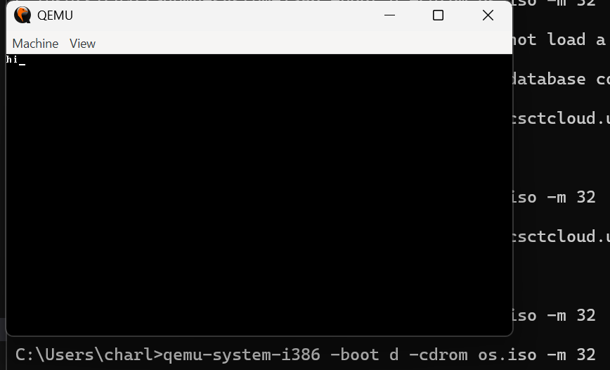

## QEMU/ Exectution method
While following the worksheet instructions on the csctcloud environment, QEMU produced display-related errors when attempting to use VGA output.
The first error I encounterd was "qemu-system-i386: -curses: invalid option" so i wasnt able to use this option.
Then the second error I encountered was without using the -curses but it still resulted in the error "gtk initialization failed" 

Becuase of these errors I decided to download qemu-w64 on my local device and download my os.iso image off the cloud environment and I ran it locally using this qemu command: "qemu-system-i386 -boot d -cdrom os.iso -m 32" which provided the correct output of "hi" in the OS!

# Worksheet 2 part 2
## Task 1 - keyboard input via interrupts 
In this task i had to extend the operating system to support keyboard input further using hardware interrupts using the provided instructions and extra files.

To start this task I added the starter files which were provided with the worksheet. these files contained basic structures required for the interrup handling, keyboard input and PIC configuration. 

### Intergrating these files
I downloaded and extracted the provided files and intergrated them into my existing project structure. I put all the low-level hardware and driver related code into the drivers/ folder and put the kernel code in source/

These are the files that were added
* interrupt handling
    * interrupts.c
    * interrupts.h 
    * interrupt_asm.s
    * interrupt_handlers.s
* Programmable interrupt controller
    * pic.c
    * pic.h
* Keyboard input
    * keyboard.c
    * keyboard.h 
* Interrupt enabling
    * hardware_interrupt_enabler.s
    * hardware_interrupt_enabler.h

### Reading scan code from the keyboard
In interrupts.c there is a function called interrupt_handler, the interrupt handler checks the keyboard status register to determine if data is available and then reads the scan code raw from the keyboard data port using inb instrction.

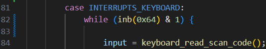

key release events are ignored ensuring only key press events are processed.

### Converting scan codes to ASCII
The raw scan codes are taken and converted into ASCII using a lookup table that was already implemented into keyboard.c.

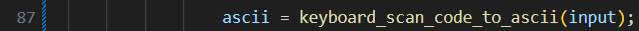

If a scan code matches it outputs the character and if it does not the function returns zero instead and the input is ignored.

### Handling regular characters
For regular characters the interrupt handler writes the characters ti the VGA framebugger so that the input appears on the screen as the user types. 

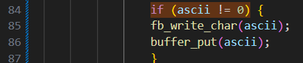

### Handling backspaces
when backspaces are detected the most recently displayed character is removed from the screen by moving the cursor backwards and overwriting the previous framebuffer cell.

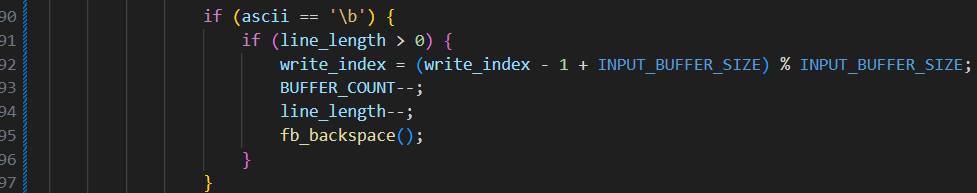

### Handling enter
when the enter key is pressed the currently line is terminated and a newline is created.

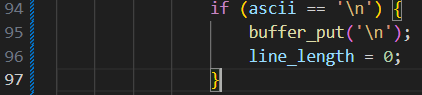

### Result of task 1 
By extending the interrupt handler function and intergrating the new driver files the OS can now:
* Receieve a keyboard input via hardware interrupts,
* Read scan codes,
* Convert scan codes into ASCII,
* Display what was typed in real time,
* Handle backspaces and enter keys

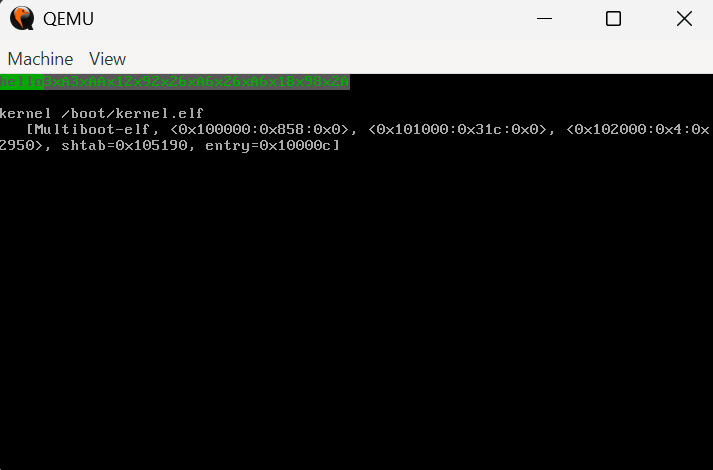

Here you can see the outcome of Task 1.

## Task 2 - input buffer API
For task 2 I built a input buffer API so the keyboard interrupt handler doesnt talk directly to the schell. Instead, key presses are stored in a circular buffer and other parts ofthe OS read characters using new functions getc and readline.

### Circular buffer design
I added the buffer state to interrupts.c

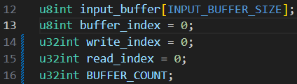

This makes the buffer act like a ring where:
* write_index is where the next character will be written
* read_index is wher the next character will be read by getc() and readline()
* BUFFER_COUNT is how many characters are stored

Then I added a small helper function to put characters into the buffer from the interrupt handler.

### Updating the keyboard interrupt handler
In task 1 the interrupt handler just coverted scan codes into ascii and directly wrote characters to the framebuffer. To exetend upon this I made it also push characters into the circular buffer for later use. This means:
* Every visible character typed is shown immediately on screen using fb_write_char
* While also storing it in the input buffer via buffer_put
* And Backspaces and newlines are also reflected apon both visually and in the buffer.

### get c and readline
In interrupt.c I added two new functions getc() and readline(). The purpose of these funcitons is to provide a clean API for reading keyboard inputs from the OS.

The getc() function provides the lowest level interface for reading input. It removes and returns a single character from the input. If the buffer is empty getc() returns 0 allowing caller code to wait until the input becomes available.

The readline function builds on to of getc to provide line based input. It repeatedly calls getc() until a newline character is recieve, storing the characters into a caller-provided buffer. Bounds checking is used to make sure the buffer does not overflow and extra characters are ignored.

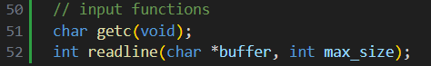

Here you can see that what im typing is being echoed back:

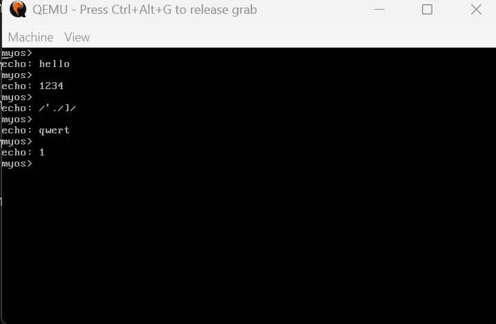

## Task 3 - Terminal implementation
The purpose of this task was to provide a basic terminal interface and create some different commands. 
To complete this task I made my terminal operate in a loop:
* first dispalying myos> 
* then the user input is read using readline()
* then the line is parsed ubto a command and optional arguements
* the command is executed if its recognised in the command list
* or an error message occurs if its not recognised

### Command parsing and dispatch
User input is parsed by splitting the into two strings:
* the command
* the arguements

A command table was added using a structuer containing:
* The command name 
* A function pointer to the command handler

When a input is entered:
1. The command name is extracted
2. The command table is searched
3. if a match is found the associated function is called
4. if no match is found an error is displayed

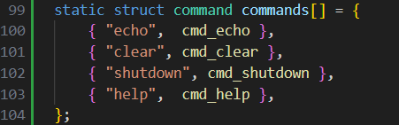

### Implemented commands
I have added 4 commands:
* echo [text] - repeats the input back to the screen
* clear - which clears the screen by resetting the VGA framebuffer and cursor
* shutdown - which initates a system shutdown by writing to QEMUs ACPI power management port
* help - which displays a list of available commands and thier descriptions

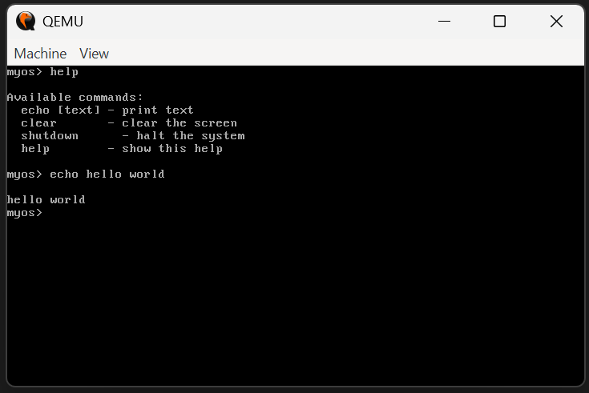

This image shows the commands working in action.